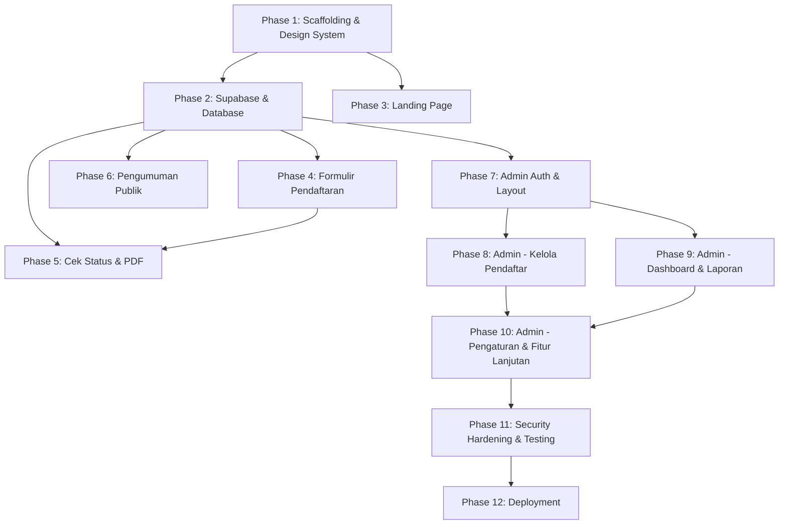

# Implementation Plan — Sistem SPMB SD Plus 3 Al-Muhajirin

## Dependency Graph

## Execution Strategy

### Phase 1: Project Scaffolding & Design System
**Dependency:** None
**Risk:** Low
**Estimated Files:** 5-6

Inisialisasi Next.js project, install semua dependencies, setup design system (CSS custom properties, global styles, reusable UI components). Ini adalah fondasi yang semua phase lain bergantung padanya.

### Phase 2: Supabase Setup & Database
**Dependency:** Phase 1
**Risk:** Medium — schema harus benar dari awal, perubahan nanti costly
**Estimated Files:** 6-8

Setup Supabase project, buat migrations (4 tabel), RLS policies, storage bucket, seed data admin & pengaturan. Generate TypeScript types.

### Phase 3: Landing Page
**Dependency:** Phase 1 (design system)
**Risk:** Low — pure UI, bisa dikerjakan paralel dengan Phase 2
**Estimated Files:** 7-8

Build semua section landing page: Hero, Timeline, Persyaratan, Jadwal, Biaya, Program Kelas, FAQ, Kontak. Mobile-first responsive.

### Phase 4: Formulir Pendaftaran
**Dependency:** Phase 1 + Phase 2
**Risk:** High — multi-step form dengan conditional logic, file upload, dan validasi kompleks
**Estimated Files:** 10-12

Build formulir 4 langkah, Zod validations, file upload component, API routes (submit, upload), nomor pendaftaran generator.

### Phase 5: Cek Status & Bukti PDF
**Dependency:** Phase 2 + Phase 4
**Risk:** Medium — PDF generation dan QR code
**Estimated Files:** 6-7

Halaman cek status (progress tracker, detail dokumen, edit data, unggah ulang), generate bukti pendaftaran PDF dengan QR code.

### Phase 6: Halaman Pengumuman
**Dependency:** Phase 2
**Risk:** Low — simple read-only table
**Estimated Files:** 2-3

Halaman publik daftar siswa diterima dengan search/filter.

### Phase 7: Admin Auth & Layout
**Dependency:** Phase 2
**Risk:** Medium — auth flow & middleware
**Estimated Files:** 4-5

Login page, middleware proteksi, admin layout (sidebar, header), Supabase Auth integration.

### Phase 8: Admin — Kelola Pendaftar
**Dependency:** Phase 7
**Risk:** Medium — banyak fitur CRUD
**Estimated Files:** 6-8

Daftar pendaftar (tabel, filter, search), detail pendaftar, verifikasi dokumen, input OKB, ubah status, pindah kelas, catatan admin, share WhatsApp.

### Phase 9: Admin — Dashboard & Laporan
**Dependency:** Phase 7
**Risk:** Medium — chart & real-time data
**Estimated Files:** 5-6

KPI cards, grafik demografi (Recharts), tabel peringatan dini, real-time data dari Supabase.

### Phase 10: Admin — Pengaturan & Fitur Lanjutan
**Dependency:** Phase 8 + Phase 9
**Risk:** Low
**Estimated Files:** 4-5

Toggle buka/tutup, kuota per kelas, jadwal & biaya, ekspor CSV/Excel, log aktivitas.

### Phase 11: Security Hardening & Testing
**Dependency:** Phase 1-10
**Risk:** Medium — harus thorough
**Estimated Files:** 5-8

Rate limiting, secure headers, file upload hardening (magic bytes), input sanitization review, unit tests (Vitest), E2E tests (Playwright).

### Phase 12: Deployment
**Dependency:** Phase 11
**Risk:** Low — Vercel deployment straightforward
**Estimated Files:** 2-3

Vercel configuration, environment variables, DNS setup guide, final smoke test.

## Risks & Mitigations

| Risk | Impact | Mitigation |
|---|---|---|
| Schema database salah di awal | High — migrasi ulang costly | Review schema di Phase 2 sebelum lanjut |
| File upload vulnerability | High — security risk | Server-side magic bytes validation, signed URLs |
| PDF generation lambat | Medium — UX issue | Generate async, cache hasil |
| Mobile responsiveness kurang | Medium — mayoritas user via HP | Test di 360px viewport setiap phase |
| Supabase rate limits | Low — traffic sekolah tidak tinggi | Monitor usage, optimize queries |

## Parallel Work Opportunities

- **Phase 3** (Landing Page) bisa dikerjakan paralel dengan **Phase 2** (Database setup)
- **Phase 6** (Pengumuman) bisa dikerjakan paralel dengan **Phase 5** (Cek Status)
- **Phase 9** (Dashboard) bisa dikerjakan paralel dengan **Phase 8** (Kelola Pendaftar)
